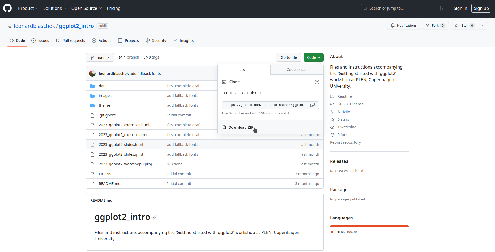

# Getting started with ggplot2
Files and instructions accompanying the ggplot2 workshop at PLEN, Copenhagen University on 2023-10-24.

To prepare for the seminar, install R, Rstudio and the `tidyverse` R package.
RStudio prepared an excellent step-by-stp guide [here](https://rstudio-education.github.io/hopr/starting.html).

Then download the seminar files by clicking on `Code` and `Download ZIP`. 
Unzip the downloaded file.

